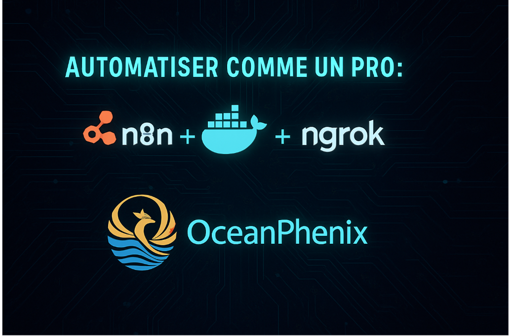

# Automations n8n

Collection d'outils et ressources pour l'automatisation avec n8n.



## 📑 Vue d'ensemble

Ce dépôt contient des outils, configurations et ressources pour mettre en place et exploiter n8n, une plateforme d'automatisation de flux de travail extensible.

## 🚀 Contenu

### Installation et Configuration
- Configuration Docker avec accès HTTPS via ngrok
- Documentation détaillée pour démarrage rapide
- Workflows d'exemple (intégration IA, etc.)

### Matériel de Formation
- Structure modulaire pour formation
- Ressources pédagogiques prêtes à l'emploi
- Slides et exemples pratiques

### Marketing et Intégrations
- Ressources pour promouvoir sur LinkedIn
- Intégration avec Notion et PayPal
- Outils de création de contenu

## 💻 Démarrage rapide

```bash
# Cloner le dépôt
git clone https://github.com/votre-username/Automations_n8n.git

# Naviguer vers le répertoire principal
cd n8n-docker-https-setup

# Lancer n8n (requiert Docker)
python 0-start_n8n_menu.py
```

## 🔑 Fonctionnalités principales

- **Auto-hébergement**: n8n sur votre propre infrastructure
- **Intégration IA**: Automatisation intelligente des tâches
- **Documentation**: Guides détaillés et exemples
- **Formation**: Matériel pédagogique complet

## 📚 Ressources

- [Documentation officielle n8n](https://docs.n8n.io/)
- [Communauté n8n](https://community.n8n.io/)

## 📄 Licence

MIT - voir LICENSE pour plus de détails.

---

Créé par Stéphane CELTON - [Ocean Phenix](https://oceanphenix.fr)
