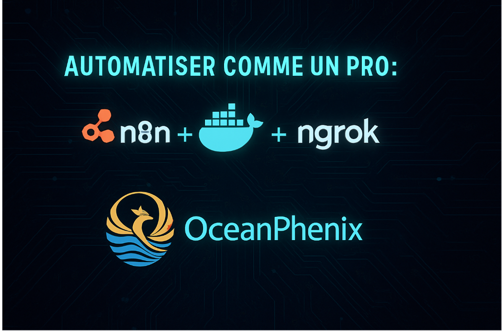

# Automations n8n - Suite d'outils d'automatisation

## 📑 Vue d'ensemble

Ce dépôt contient une collection complète d'outils, configurations et ressources pour mettre en place, déployer et exploiter n8n dans divers contextes d'automatisation. n8n est une puissante plateforme d'automatisation de flux de travail extensible qui peut remplacer des outils comme Zapier ou Make (Integromat).

## 🚀 Principaux projets

### n8n-docker-https-setup
Configuration Docker complète pour déployer n8n avec accès HTTPS via ngrok. Inclut:
- Fichiers Docker Compose prêts à l'emploi
- Scripts d'aide au démarrage et diagnostic
- Configuration HTTPS via ngrok
- Documentation détaillée
- Workflows d'exemple (Agent IA, etc.)

### udemy-course-creator
Outils et structure pour la création d'un cours Udemy sur n8n:
- Structure complète du cours modulaire
- Scripts pour générer les ressources pédagogiques
- Modèles de slides, exercices et documentation
- Planificateur de progression du cours

### notion-paypal-store
Système de vente de formations en ligne via Notion et PayPal:
- Configuration de Notion comme CMS
- Intégration avec PayPal pour les paiements
- Workflows n8n pour l'automatisation des accès
- Documentation sur la configuration du domaine personnalisé

### linkedin-marketing
Ressources marketing pour promouvoir n8n sur LinkedIn:
- Modèles de posts et articles
- Stratégie de contenu et planification
- Visuels et infographies
- Guides pour maximiser l'engagement

### n8n-to-notion
Système d'exportation des workflows n8n vers Notion:
- Workflows pour automatiser la documentation
- Structure Notion optimisée
- Export en markdown et HTML

### n8n-docker-youtube-content
Outils pour créer du contenu YouTube sur n8n:
- Scripts de génération de contenu
- Modèles de segments vidéo
- Organisation des ressources visuelles

### n8n-presentation
Présentation complète de n8n pour formations et démonstrations:
- Slides détaillés
- Notes de présentation
- Exemples de démos

## 🔧 Prérequis techniques

- Docker et Docker Compose
- Node.js (v14+)
- Python 3.8+ (pour certains scripts utilitaires)
- Compte ngrok (gratuit ou payant)
- Compte n8n (si utilisation du cloud) ou serveur pour auto-hébergement

## 💻 Installation rapide

Pour démarrer avec la configuration Docker de base:

1. Clonez ce dépôt
2. Naviguez vers le répertoire n8n-docker-https-setup
3. Exécutez `python 0-start_n8n_menu.py` et choisissez l'option 1
4. Accédez à n8n via http://localhost:5678

Pour l'accès HTTPS via ngrok:
1. Configurez votre token ngrok
2. Exécutez `start_ngrok.bat` (Windows) ou `start_ngrok.sh` (Linux/Mac)
3. Utilisez l'URL HTTPS fournie par ngrok

## 🔑 Fonctionnalités principales

- **Auto-hébergement sécurisé**: Déployez n8n sur votre propre infrastructure
- **Accès HTTPS**: Configurez un accès sécurisé même en développement local
- **Intégration IA**: Workflows utilisant l'IA pour automatiser les tâches complexes
- **Documentation complète**: Guides détaillés et documentation Streamlit
- **Matériel de formation**: Ressources pédagogiques pour former d'autres utilisateurs
- **Outils de marketing**: Ressources pour promouvoir vos compétences n8n

## 📈 Cas d'usage

- **Automatisation du marketing**: Publication sociale, surveillance de marques
- **Automatisation de la veille**: Collecte et analyse de données web
- **Automatisation des ventes**: Suivi des prospects, qualification de leads
- **Création de contenu**: Génération et planification de contenu avec IA
- **Intégrations métier**: Connexion entre différents systèmes et APIs

## 📚 Ressources et liens

- [Documentation officielle n8n](https://docs.n8n.io/)
- [Communauté n8n](https://community.n8n.io/)
- [Discord n8n](https://discord.gg/sSJC2CFP7T)
- [GitHub n8n](https://github.com/n8n-io/n8n)

## 🤝 Contribution

Les contributions sont les bienvenues! Voici comment contribuer:

1. Forkez le dépôt
2. Créez une branche pour votre fonctionnalité
3. Commitez vos changements
4. Poussez vers la branche
5. Ouvrez une Pull Request

## 📄 Licence

Ce projet est sous licence MIT - voir le fichier LICENSE pour plus de détails.

---

Créé par Stéphane CELTON - [Ocean Phenix](https://oceanphenix.fr)
